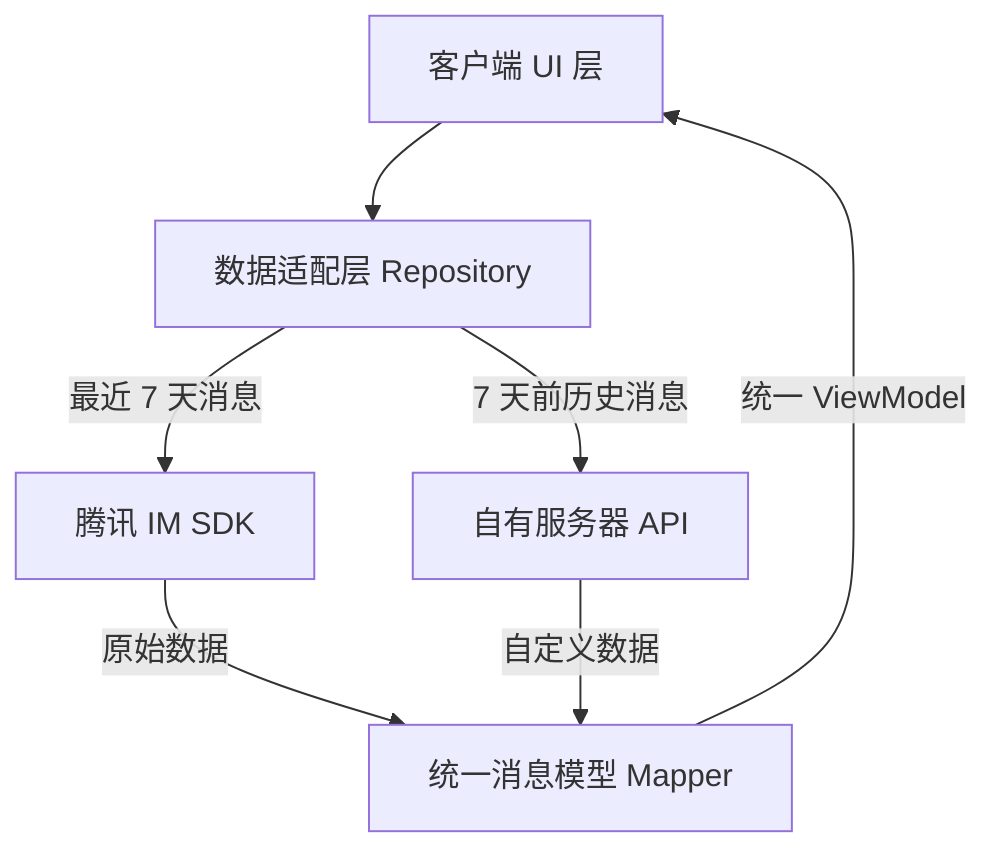

# 腾讯 IM 欧洲区方案评估与分析报告

## 1. 核心结论：方案可行性评估

你提出的 **"屏蔽缺失功能 + 仅依赖服务端字段"** 的思路在**大方向上是可行的**，也是目前行业内解决此类合规问题的通用做法。

但经过详细对比腾讯 IM 文档，**直接简单屏蔽**会带来严重的用户体验断层。你需要引入一个**"双数据源 + 统一模型"**的中间层来平滑这个问题。

| 评估维度 | 结论 | 说明 |
| :--- | :--- | :--- |
| **合规性** | ✅ 通过 | 消息转存自有服务器，腾讯侧仅做通道，符合 GDPR 数据主权要求。 |
| **技术落地** | ⚠️ 有风险 | 腾讯回调数据确实比 SDK 下发数据“阉割”严重，直接硬切会导致 UI 报错。 |
| **用户体验** | ⚠️ 需妥协 | 部分高级功能（如消息引用、精确未读数）可能需要降级处理。 |

---

## 2. 关键痛点：数据结构差异分析 (Gap Analysis)

经过调研腾讯云 IM `V2TIMMessage` (SDK) 与 `Callback` (服务端回调) 的结构，主要差异如下：

### 2.1 核心字段缺失清单

| 字段类别 | SDK (客户端可见) | Callback (服务端回调可见) | 影响评估 |
| :--- | :--- | :--- | :--- |
| **基础标识** | `msgID` (完整 UUID) | `MsgKey` (非标准 UUID) | ⚠️ **严重**：无法直接通过 ID 对应消息，需建立映射关系。 |
| **排序字段** | `sequence` (严格递增) | `MsgSeq` (可能缺失或不连续) | ⚠️ **严重**：历史消息拉取时可能导致乱序。 |
| **扩展数据** | `cloudCustomData` | `CloudCustomData` (部分事件不带) | ⚠️ **中等**：依赖此字段的业务逻辑（如引用消息 ID）会失效。 |
| **发送者信息** | `faceURL`, `nickName` | 仅 `From_Account` | ℹ️ **可规避**：服务端需自行查询用户资料补全。 |
| **状态信息** | `isRead`, `status` | 无 (无实时状态回调) | ⚠️ **严重**：无法在历史消息中准确还原"已读/未读"状态。 |

### 2.2 无法复现的功能 (必须屏蔽或重写)

基于上述缺失，以下功能在**"纯自有服务器模式"**下无法直接复用腾讯 SDK 逻辑：

1.  **消息引用 (Reply)**: 依赖原始 `msgID` 和 `cloudCustomData` 中的引用快照，回调中通常不完整。
2.  **精准未读数**: 腾讯的未读数是基于其内部 Sequence 计算的，自有服务器很难完全对齐，建议**自建简易未读计数**。
3.  **多端漫游状态同步**: 比如在手机 A 读了，手机 B 只有在拉取腾讯漫游时才能同步状态；自有服务器很难做到毫秒级状态同步。

---

## 3. 推荐架构：双轨制数据源 (Dual-Source Strategy)

为了解决"既要合规，又要体验"的矛盾，建议采用**分段式数据源**策略，而不是一刀切。

### 3.1 架构图示

### 3.2 核心策略

1.  **热数据 (Hot Data, <7天)**:
    *   **来源**: 直接使用腾讯 IM SDK 接口 (`V2TIMManager.getMessage`).
    *   **优势**: 体验完美，支持所有高级功能（引用、状态同步、撤回）。
    *   **合规**: 腾讯保留 7 天符合 GDPR "短期传输缓存" 的定义（需法务确认，通常可解释）。

2.  **冷数据 (Cold Data, >7天)**:
    *   **来源**: 从**自有服务器**分页拉取。
    *   **结构**: 使用你定义的"阉割版"消息结构。
    *   **展示**: UI 上展示为"历史存档"，仅保留核心内容（文本、图片、文件），屏蔽引用、已读状态等高级 UI 组件。

3.  **数据缝合 (Stitching)**:
    *   客户端需要实现一个逻辑：当 SDK 返回 `no more messages` 时，自动触发自有服务器 API 继续加载更早的消息。

---

## 4. 执行建议与下一步

### 4.1 服务端建设 (Priority P0)
*   **搭建回调接收器**: 监听腾讯 `State.StateChange` 和 `C2C.CallbackBeforeSendMsg` 等核心回调。
*   **数据清洗**: 将回调数据清洗为自定义的 `MessageEntity` 存入 MongoDB/MySQL。
*   **补全用户信息**: 收到消息 ID 后，异步调用腾讯 API 获取发送者头像/昵称并落库（因为回调里没有）。

### 4.2 客户端改造 (Priority P1)
*   **抽象 MessageModel**: 定义一个不依赖腾讯 SDK 的纯数据 Model。
*   **封装 Repository**: 屏蔽数据来源（SDK vs Server），对上层 UI 提供统一流。

### 4.3 功能降级清单 (Priority P2)
*   在显示**自有服务器的历史消息**时：
    *   隐藏 "已读" 标记。
    *   将 "引用消息" 降级为纯文本显示（如：`[引用] 原始内容...`）。
    *   禁用 "撤回" 和 "编辑" 功能。
